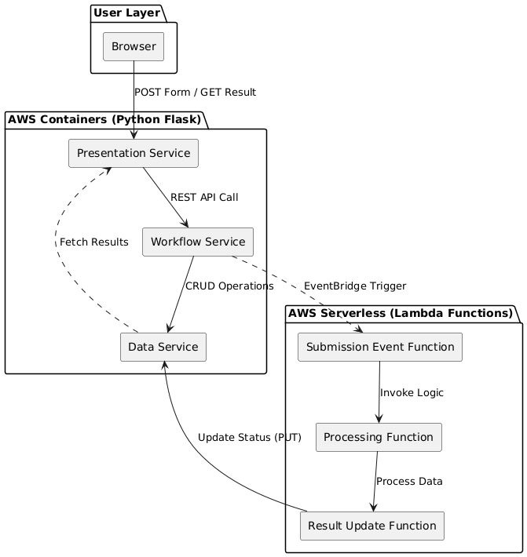

# Campus Buzz — Mini-Project 1

**Cloud Execution Models: Containers and Serverless**

## Project Overview

Campus Buzz is a hybrid cloud application that accepts campus event submissions, performs automated background validation, and returns categorized results to the user. The system combines **container-based services** (Flask web applications) with **AWS Lambda serverless functions** to demonstrate cloud-native architectural patterns.

## Architecture



---

## System Components (6 Required Components)

| Component                    | Type      | Port/Endpoint | Role                                       |
| ---------------------------- | --------- | ------------- | ------------------------------------------ |
| `presentation-service/`      | Container | 5000          | Web UI, form submission, result display    |
| `workflow-service/`          | Container | 5001          | Record creation, Lambda invocation         |
| `data-service/`              | Container | 5002          | SQLite storage, CRUD API                   |
| `submission-event-function/` | Lambda    | —             | Event forwarding to processing             |
| `processing-function/`       | Lambda    | —             | Validation rules, categorization, priority |
| `result-update-function/`    | Lambda    | —             | Database update with processed result      |

## Validation Rules

1. **INCOMPLETE** — Any required field (title, description, location, date, organiser_name) is missing or empty
2. **NEEDS REVISION** — Date format is not `YYYY-MM-DD`, OR description is shorter than 40 characters
3. **APPROVED** — All checks pass

**Category Assignment**:

- Contains `career`, `internship`, or `recruitment` → `OPPORTUNITY`
- Contains `workshop`, `seminar`, or `lecture` → `ACADEMIC`
- Contains `club`, `society`, or `social` → `SOCIAL`
- Otherwise → `GENERAL`

**Priority Assignment**:

- `OPPORTUNITY` → HIGH | `ACADEMIC` → MEDIUM | `SOCIAL`/`GENERAL` → NORMAL
  
  > OPPORTUNITY > ACADEMIC > SOCIAL > GENERAL

### File Structure

```
campus-buzz-mini-project-main/
├── presentation-service/       # Container: Web UI
│   ├── app.py                  # Flask application
│   ├── Dockerfile
│   ├── requirements.txt
│   └── templates/
│       ├── index.html          # Submission form
│       └── result.html         # Result display
├── workflow-service/           # Container: Workflow orchestration
│   ├── app.py                  # Flask application
│   ├── Dockerfile
│   └── requirements.txt
├── data-service/               # Container: Data persistence
│   ├── app.py                  # Flask + SQLite API
│   ├── Dockerfile
│   └── requirements.txt
├── submission-event-function/  # Lambda: Event routing
│   └── lambda_function.py
├── processing-function/        # Lambda: Business logic
│   └── lambda_function.py
└── result-update-function/     # Lambda: Result persistence
    └── lambda_function.py
```

## Testing the System

1. Navigate to the Presentation Service URL
2. Fill in the submission form with test data
3. Click "Submit Event"
4. View the result page showing status, category, and priority

### Dependencies

- Python 3.11
- Flask
- requests
- SQLite
